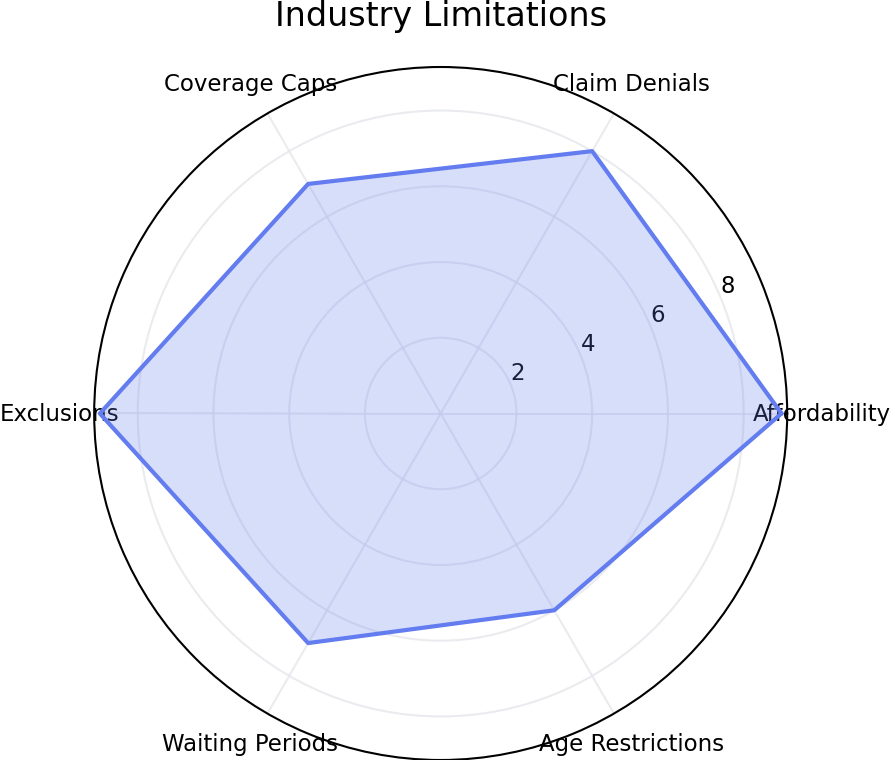

# Pet Insurance Dashboard
Run: streamlit run pet_insurance_dashboard.py

# Pet Insurance Analytics Dashboard

## Overview

This project analyzes pet insura*ce adoption, affordability, claims* complaints, and market limitation* using data from:

- NAPHIA
- AVMA*- APPA
- NAIC
- Kaggle datasets

#* outputs

## Output Charts


.png>)

.png>)

.png>)

.png>)

.png>)

.png>)



## Tech Stack

- Python
- Pandas
- Plotly
- Streamlit*
## Installation

```bash
pip install -r requirements.txt
```

## Run*
```bash
streamlit run pet_insuran*e_dashboard.py
```

## Dashboard P*eview

(Add screenshots here)

## Insights

- 95%+ of pets remain uninsured
- Premiums growing faster th*n enrollment
- Cats are significantly underinsured
- Claim denials remain a major user concern
- Affordability is the largest market barrier
